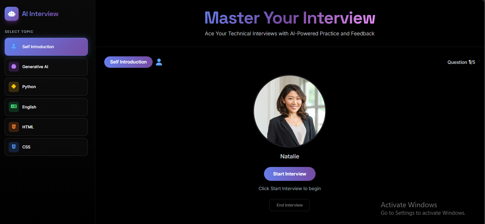

# Interview Assistant

A polished AI-powered interview practice experience that helps candidates rehearse real conversations with voice interaction, intelligent follow-up questions, and instant feedback.



## ✨ Overview

Interview Assistant is a modern web application that simulates a realistic interview session. Candidates can choose a subject, respond verbally, and receive AI-generated follow-up questions as if they were speaking with a human interviewer.

The platform combines:
- Voice-based interview flow
- AI-generated questions and conversational responses
- Automated feedback and score suggestions
- A clean, recruiter-friendly interface

## 🚀 Features

- Select from multiple interview topics such as Python, English, HTML, CSS, and more
- Start a realistic interview session with a friendly interviewer
- Record answers and process them through speech-to-text
- Receive adaptive questions based on prior responses
- Generate detailed feedback at the end of the interview
- Enjoy a smooth and visually appealing user experience

## 🧠 How it Works

1. The user selects an interview subject.
2. The backend starts a conversational interview session.
3. The system asks short, adaptive questions one by one.
4. The user answers verbally.
5. The app transcribes the response and continues the interview.
6. After completion, AI-generated feedback is provided.

## 🛠️ Tech Stack

### Frontend
- HTML
- JavaScript
- Tailwind CSS-inspired styling

### Backend
- Python
- Flask
- LangChain
- LangGraph
- AssemblyAI
- Murf AI
- Google Gemini

## 📁 Project Structure

```bash
InterviewAssistant/
│
├── backend/
│   └── app.py
│
└── frontend/
    ├── index.html
    └── index.js
```

## ⚙️ Setup Instructions

### 1. Clone the repository

```bash
git clone https://github.com/BugataPravallika/Interview-Assistant.git
cd InterviewAssistant
```

### 2. Set up the backend

```bash
cd backend
pip install -r requirements.txt
```

If a requirements file is not present, install the needed packages manually:

```bash
pip install flask flask-cors python-dotenv langchain langgraph assemblyai requests
```

### 3. Configure environment variables

Create a `.env` file inside the backend folder and add:

```env
GOOGLE_API_KEY=your_google_api_key
MURF_API_KEY=your_murf_api_key
ASSEMBLYAI_API_KEY=your_assemblyai_api_key
```

### 4. Run the application

```bash
python app.py
```

Then open the frontend in your browser.

## 🎯 Use Case

This project is ideal for:
- Job seekers practicing interviews
- Students preparing for technical interviews
- Recruiters exploring AI-based conversational assessment tools
- Developers building voice-enabled interview platforms

## 🌟 Why This Project Stands Out

- Combines AI, voice, and web technologies in one experience
- Designed to feel interactive and human-like
- Offers both conversation practice and feedback generation
- Presents a strong portfolio project for showcasing AI application development skills

## 📌 Future Improvements

- Add user authentication
- Save interview history
- Support multiple languages
- Improve speech recognition accuracy
- Add dashboard analytics for performance tracking

## 👩‍💻 Developer

Built by Pravallika Bugata
gmail:pravallikabugata@gmail.com
